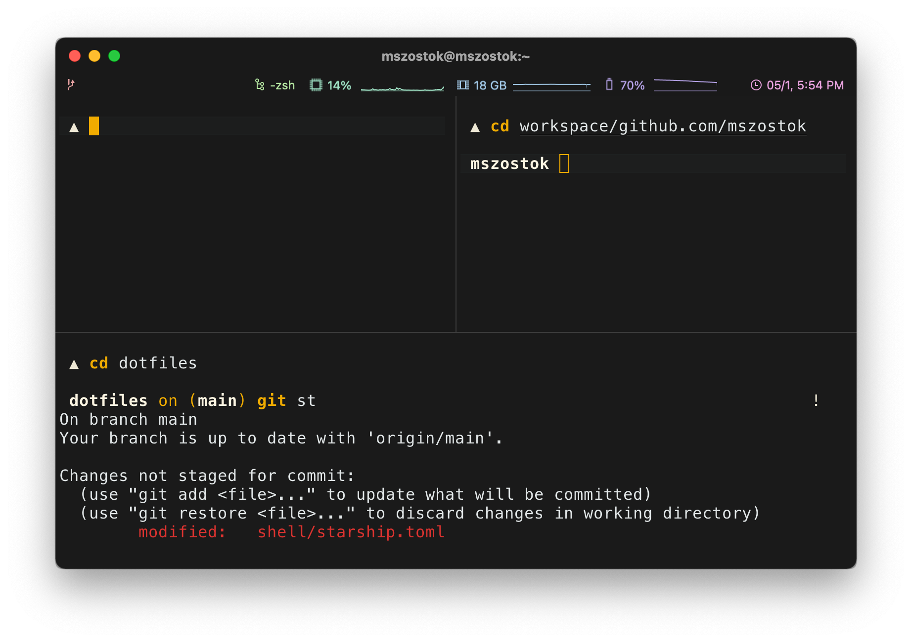

# mszostok's dotfiles

## Contents

- All my `brew` dependencies including: applications, fonts, etc. See [`Brewfile`](./Brewfile).

  > **NOTE:** Initial file was created via [Homebrew Bundle](https://github.com/Homebrew/homebrew-bundle).
  > To dump the App Store applications, [`mas`](https://github.com/mas-cli/mas) needs to be installed.
  > Finally, you can run: `brew bundle dump`.

- All my `macOS` configuration. See [`macos`](./macos/).
- All my shell configuration, including my own theme. See [`shell/`](./shell)
  and [`config/zshrc`](./config/zshrc).

## Installation

The [`dotbot`](https://github.com/anishathalye/dotbot/) is used to set things up. Steps:

1. Clone this repo with: `git clone --depth 1 https://github.com/mszostok/dotfiles dotfiles && cd dotfiles/`
2. Install applications: [`./install`](./install)
   > **NOTE:** To install macOS Applications export `APPS=true` environment variable.
3. Configure macOS settings: `./macos/settings.sh`
4. Set iTerm2 preferences:
   1. Go to **Preferences > General**
   2. Enable **Load preferences from a custom folder or URL**
   3. Click Browse and select [`./config/iterm`](./config/iterm)
5. Read [manual-step.md](./docs/manual-step.md) to finish configuration.

## CLI

The [iTerm2](https://iterm2.com/) is used along with [`zsh`](https://github.com/zsh-users/zsh)
and [`oh-my-zsh`](https://github.com/robbyrussell/oh-my-zsh) as the main shell.

## Apps

The [`brew`](https://brew.sh/) is used to install all free apps for my Mac. I also sync apps from AppStore with `brew`
via [`mas`](https://formulae.brew.sh/formula/mas), so the
resulting [`Brewfile`](https://github.com/sobolevn/dotfiles/blob/master/Brewfile) contains everything.

## Local configuration

Some used tools require local configuration. Such as `git` with username and email.

## Mackup

The [mackup](https://github.com/lra/mackup) tool seems to be great. It's included in [Brewfile](./Brewfile), and
its [configuration](./config/mackup.cfg) is available automatically, but I don't use it for now.

## Possible Alternatives

- https://github.com/twpayne/chezmoi/

## License

Inspired by [sobolevn/dotfiles](https://github.com/sobolevn/dotfiles). The transitive license applies with one
additional requirement: don't make any harm.

[WTFPL](https://en.wikipedia.org/wiki/WTFPL): do the f* you want. Enjoy!
