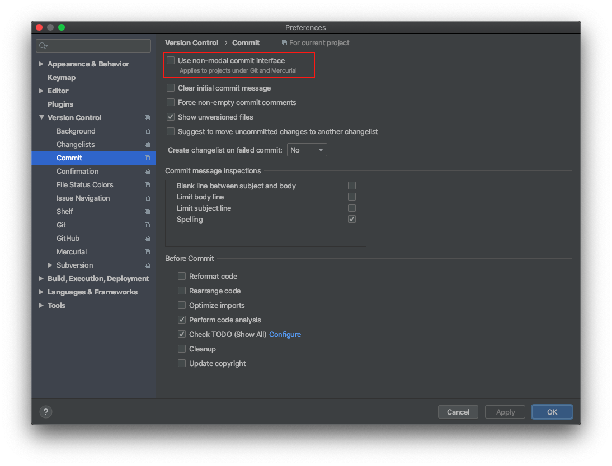

# Manual configuration

### IntelliJ

> [!NOTE]
> [_Just login to JetBrains account, as data is saved
there._](https://www.jetbrains.com/help/idea/sharing-your-ide-settings.html#IDE_settings_sync)

Press `⌘Сmd+`, to open Settings, go to `Settings Sync`, and then click `Enable Settings Sync`.

List of changes:

1. Enable: `Use "CamelHumps" words`.
2. [Restore Local Changes view](https://coderedirect.com/questions/498036/cant-find-git-local-changes-in-intellij-idea-2020-1)
	 
3. Change keymapping to IntelliJ Classic.
4. Change mappings:
	- `cmd + 1` - Project
	- `cmd + 2` - Terminal
	- `cmd + 3` - Git
	- `shift + cmd + o` - Open Recent
5. Set Tab placement to `None`.
6. Install the [Wakatime](https://wakatime.com/intellij-idea) plugin.

### Wakatime (terminal)

> **NOTE:** Time spend on editor is tracked by a dedicated plugins e.g. by plugin for IntelliJ. To enable it in terminal
> the [wakatime-cli](https://github.com/wakatime/wakatime-cli) needs to be installed and proper shell plugin configured.

The Wakatime CLI is defined in [Brewfile](../Brewfile). The only thing is to make sure your API Key is in
your `~/.wakatime.cfg` file.

Follow the [official instructions](https://wakatime.com/terminal#install-iterm2) for setting up in the terminal.

## GPG Key

Import it from the flash drive by following [this](./restore-gpg) instruction.
